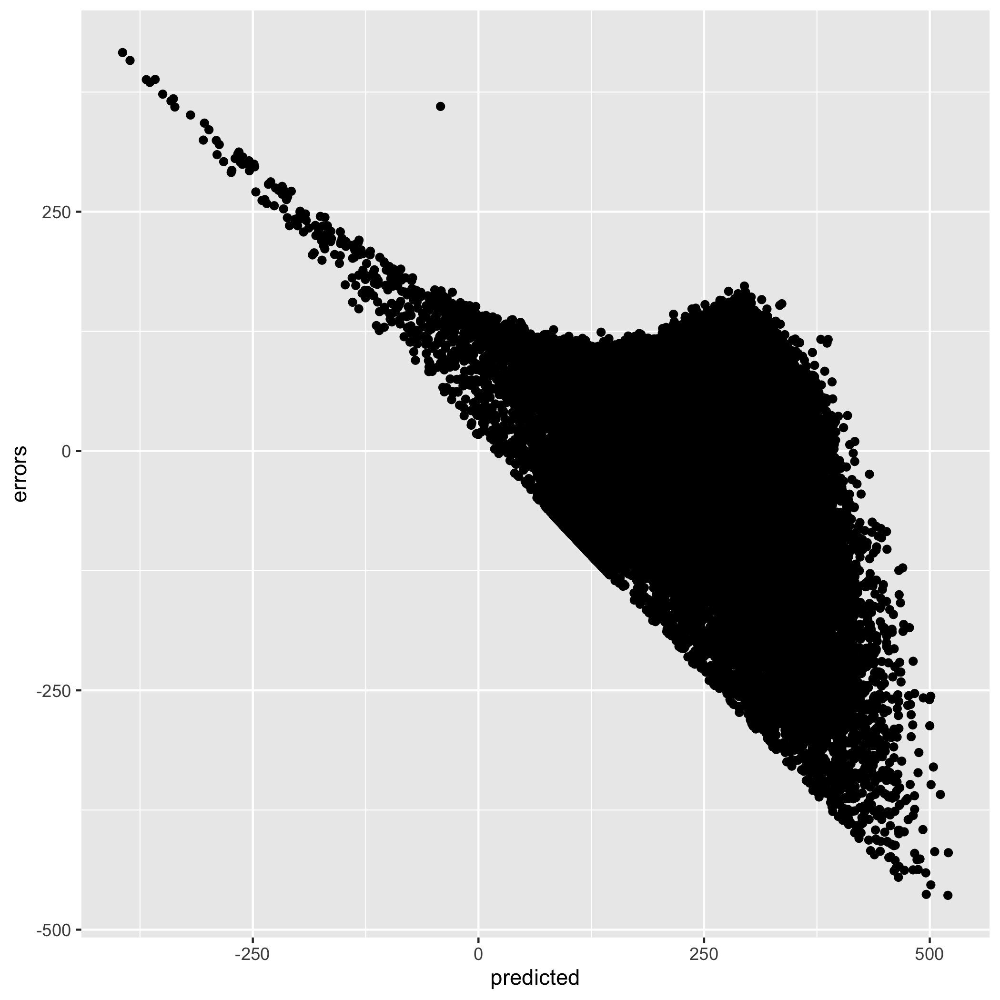

For reference, all of my code can be found [on my GitHub repo](https://github.com/ian-curtis/mlb-hit-dist). My scraped data is also there under the file name `mlb_hit_dist.csv`.

# Progress So Far

Thus far in my project, I have completed quite a bit and am currently ahead of my planned schedule. I was able to successfully use the `baseballr` package to collect the necessary data for the project. Due to HTTP limits, I did have to iterate and request data one day at a time and then merge them all together. I wrote a script (`scrape.R`) for this step so that it only has to be done one time and not every time R Studio reopens. In this process, I selected certain variables that I thought might have an effect on hit distance.

I then began work on some exploratory data analysis (`eda.Rmd`). I wanted to make sure I did this step to check the linear regression assumptions and had to make some decisions because of this. I determined that some variables had to be transformed (such as the square root of pitch number) due to skewness and others I had to filter further (such as inning) due to not enough observations. I also decided against including some variables. After my transformations and limitations, everything seemed ok for regression; the variables' distributions appeared approximately normal.

After some EDA, I began the project (`project.Rmd`). This included importing the data, applying some filters from my EDA, adding in dummy variables and some interaction variables, creating a categorical variable for hit distance zone, and splitting the data into a train and test dataset (85% vs. 15%). I then decided on how to split up the field into categories. Each number corresponds to a Zone in the field (i.e., 1. = Zone 1, etc.):

1. 0 - 70 (feet)
2. 71 - 140
3. 141 - 210
4. 211 - 280
5. 281 - 350
6. 351+

Once I had data in the correct format, I started exploring regression techniques. It took some trial and error and I had to dig out my previous notes, but I was able to successfully implement my algorithm from scratch using matrices. I definitely appreciate functions such as `lm` that do this for you but it is quite rewarding to have done it myself. I also was able to calculate some helpful statistics such as $R^2$, $s^2$, the overall $F$ statistic, and its associated $p$-value. From this, I discovered that the regression algorithm did a pretty good job.....but isn't valid (see Challenges below).

# Challenges

A few challenges presented themselves in this process. The most important is that a regression algorithm is not a good fit for this instance as it does not produce valid results. Everything was looking pretty good (e.g., I had tested a full model and several reduced models) and $R^2$ was over 30% until I checked the residual plot. This is supposed to show a random scatter of points and most certainly does not (see image below). 

{width=50%}

I'm not exactly sure, but this may be due to the fact that hit distances cannot be less than 0? Either way, I cannot trust my regression results. It's possible that they aren't too terrible but since an assumption has been violated, I can't assume that the regression output is accurate. The good news is that the algorithm is only about 20% accurate according to a confusion matrix but it's disappointing to know that it isn't valid.

Another challenge I recently had (and still need to look into) is that it appears two variables are driving the analysis: `launch_speed` and `launch_angle`. This makes total sense: the speed of the ball off the bat and the angle at which the batted ball is hit are pretty good predictors of how far the ball will go. Ideally, I'd like to find a way to do better than just these two variables, especially if I can include variables that occur *before* the ball it hit (otherwise there isn't enough time to make a decision). My biggest concern however is just getting a decision tree and neural network to work before I customize any variables.

# Next Steps

My biggest next steps are to try and implement a decision tree and a neural network for my data. The data for these algorithms will have to be slightly different than the regression algorithm since I do not need to use dummy variables or interaction variables so I will need to update my variable selection (without changing the `train` and `test` datasets. I will then need to check the model accuracy (with a confusion matrix) and create some model cards.

Another thing I need to do is clean up my code, which is currently very messy and, for the most part, lacking comments. I really need to rename my variable so it's clear which datasets are used for each algorithm and which are for for basic preprocessing. I'm considering moving the filtering and dummy variable creation to another file to help separate that from my actual project file. Please feel free to give your opinion on this, but I don't think this code is necessary for the final report; I can simply write a bit about what I did and include any relevant graphics (in the case of EDA) in this step without bogging up the report with additional code.

